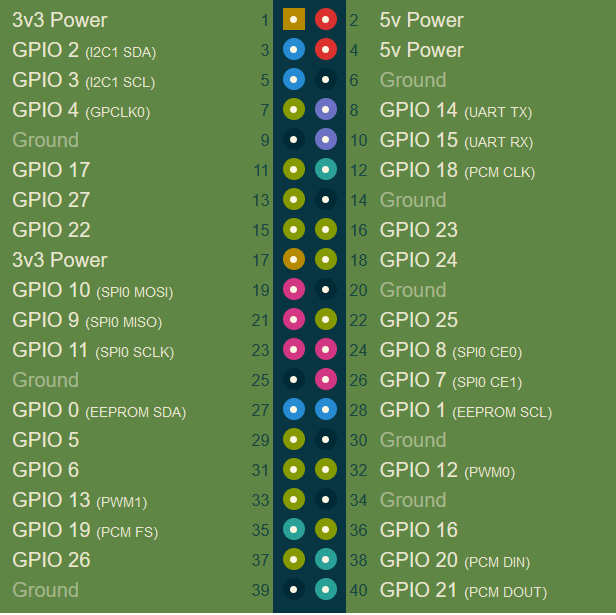

> Most info and diagrams from the [RaspberryPi documentation](https://www.raspberrypi.org/documentation/usage/gpio/) or [pinout.xyz](https://pinout.xyz)

# GPIO Pins

The Pi has 40 General-Purpose Input-Output (GPIO) pins configured in the following way:

- 2x 5V Pins
- 2x 3.3V Pins
- 8x 0V Pins (ground)

The rest of the pins are general purpose and can be assigned to either High (3.3V) or Low (0V) using software

In addition to basic Input/Output, the pins are able to perform specific functions as follows: 

> Note that GPIO 0 (pin 27) and GPIO 1 (pin 28) are available on the board but reserved for special use (EEPROM)

Some useful information on the different pinouts and their functions can be found on [pinout.xyz](https://pinout.xyz)

| Function     | Description                                                | Pins                                                                                  |
| ------------ | ---------------------------------------------------------- | ------------------------------------------------------------------------------------- |
| Software PWM | Enable  a pulsing digital signal to output analogue values | All Pins                                                                              |
| Hardware PWN | Enable  a pulsing digital signal to output analogue values | GPIO12, GPIO13, GPIO18, GPIO19                                                        |
| SPI0         | For connecting to peripheral devices                       | MOSI (GPIO10); MISO (GPIO9); SCLK (GPIO11); CE0 (GPIO8), CE1 (GPIO7)                  |
| SPI1         | For connecting to peripheral devices                       | MOSI (GPIO20); MISO (GPIO19); SCLK (GPIO21); CE0 (GPIO18); CE1 (GPIO17); CE2 (GPIO16) |
| I2C          | For 2-wite communication                                   | Data: (GPIO2); Clock (GPIO3); EEPROM Data: (GPIO0); EEPROM Clock (GPIO1)              |
| Serial       | Receival and Transmission of Async Signals                 | TX (GPIO14); RX (GPIO15)                                                              |

THe more detailed pinout diagram depicting this can be seen below:

