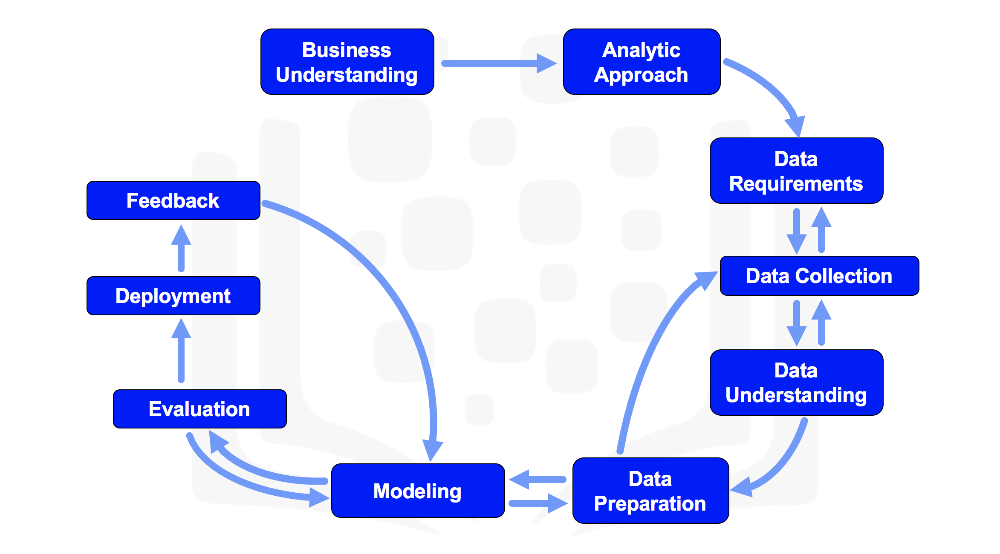

# Methodology

[Based on this Cognitive Class Course](https://cognitiveclass.ai/courses/data-science-methodology-2/)

- [Methodology](#methodology)
	- [The Methodology](#the-methodology)
	- [The Questions](#the-questions)
		- [From Problem to Approach](#from-problem-to-approach)
		- [Working with the Data](#working-with-the-data)
		- [Deriving the Answer](#deriving-the-answer)
	- [Problem and Approach](#problem-and-approach)
		- [Business Understanding](#business-understanding)
		- [Analytic Approach](#analytic-approach)
			- [Approach to be Used](#approach-to-be-used)
			- [Question Types](#question-types)
			- [Machine Learning](#machine-learning)
			- [Labs](#labs)

## The Methodology

The Methodology can be seen in the following steps

## The Questions

The Data Science methodology aims to answer ten main questions

### From Problem to Approach

1. What is the problem you are trying to solve?
2. How can you use data to answer the question?

### Working with the Data

3. What data do you need to answer the question?>
4. Where is the data coming from and how will you get it?
5. Is the data that you collected representative of the problem to be solved?
6. What additional work is required to manipulate and work with the data

### Deriving the Answer

7. In what way can the data be visualized to get to the answer that is required?
8. Does the model used really answer the initial question or does it need to be adjusted?
9. Can you put the model into practice?
10. Can you get constructive feedback into answering the question?

## Problem and Approach

### Business Understanding

> What is the problem you are trying to solve?

The firs step in the methodology involves seeking any needed clarification in order to identify what the problem we are trying to solve is as this drives the data we use and the analytical approach that we will go about applying

It is important to seek clarification early on otherwise we can waste time and resources moving in the wrong direction

In order to understand a question, it is important to understand the goal of the person asking the question

Based on this we will break down objectives and prioritize them

### Analytic Approach

> How can you use data to answer the question?

The second step in the methodology is electing the correct approach involves the specific problem being addressed, this points to the purpose of business understanding

#### Approach to be Used

When we have a strong understanding of the problem, wwe can pick an analytical approach to be used

- Descriptive
  - Current Status
- Diagnostic (Statistical Analysis)
  - What happened?
  - Why is this happening?
- Predictive (Forecasting)
  - What if these trends continue?
  - What will happen next?
- Prescriptive
  - How do we solve it?

#### Question Types

We have a few different types of questions that can direct our modelling

- Question is to determine probabilities of an action
  - Predictive Model
- Question is to show relationships
  - Descriptive Model
- Question requires a binary answer
  - Classification Model

#### Machine Learning

Machine learning allows us to identify relationships and trends that cannot otherwise be established

#### Labs

The Lab notebooks have been added in the `labs` folder

The Lab for this section is `1-From-Problem-to-Approach.ipynb`

